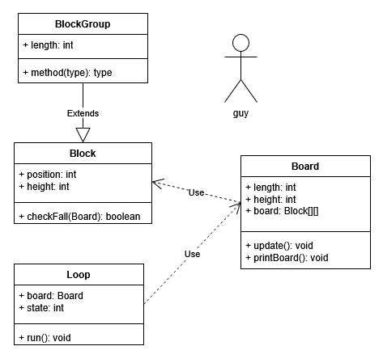

# Block Blast: Java Edition

This is a game based on the mobile game Block Blast's "More Games" gamemode.
The goal of the game is to survive as long as possible.
The game adds a line of pieces every turn, and you can only move one piece a turn.
You can clear a line by filling it completely with pieces.

This game features:
* Beautiful text-based graphics
* Expansive 8 by 10 grid
* Immersively diverse blocks
* Real-time gravitational action™

Most of the code is in the Main loop, which is split into two parts.
The first part of the main loop adds the lines and updates the board.
The second part of the loop requests user input on where to move pieces.
If you want a more in-depth explanation of the code, I wrote comments in the Main.java file.
The board is a 2D Array.
The larger blocks use inheritance for their visuals.

The following image is a visual explanation of the code:

To run the program, double click the jar file attached to the github page.
If you want to compile the code yourself, include all of the class files in the jar
